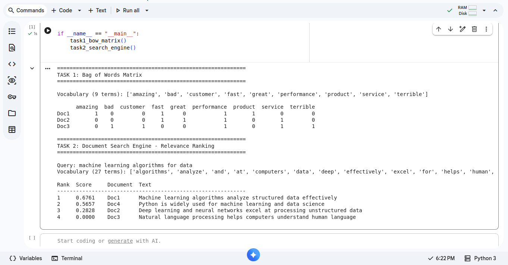

# nlp-lab-04-bow-cosine-.

# NLP Lab 04 — Bag of Words & Cosine Similarity

## Viva & Reflection Questions

**1. Word Order Invariance** — Why does "Dog bites man" have the exact same BoW representation as "Man bites dog"? How does this impact sentiment analysis?

BoW counts term occurrences and completely discards word order, syntax, and grammatical role. Both sentences contain the identical multiset of tokens (`{dog, bites, man}`), so they are mapped to the exact same vector regardless of who is doing the biting to whom. For sentiment analysis, this is a real limitation: sentences like "The food was good, not bad at all" and "The food was bad, not good at all" can end up with very similar or identical BoW vectors even though their meaning is close to opposite, because negation and word order (which determines what modifies what) are lost. This is why more advanced models use n-grams, dependency parsing, or sequence-aware models (RNNs, Transformers) when word order actually changes meaning.

**2. Sparsity Issue** — What happens to memory size and density when the vocabulary reaches 100,000 unique words?

The BoW matrix's width grows to 100,000 columns, so its theoretical size (documents × vocabulary) becomes enormous, but each individual document only ever contains a small fraction of the full vocabulary. That means the vast majority of matrix entries are zero — the matrix becomes extremely **sparse** (density approaches 0%). Storing this as a dense array would waste huge amounts of memory on zeros, which is why `CountVectorizer` returns a **sparse matrix** (e.g. SciPy CSR format) that only stores the non-zero entries and their positions, keeping memory usage proportional to the actual number of word occurrences rather than `documents × vocabulary_size`.

**3. Zero Similarity** — Why does Document 3 score 0.0000 against the query "machine learning algorithms for data"?

Cosine similarity is proportional to the dot product of the two vectors, ∑ Aᵢ·Bᵢ. Document 3 ("Natural language processing helps computers understand human language") shares **no vocabulary terms at all** with the query ("machine learning algorithms for data") — none of `natural, language, processing, helps, computers, understand, human` appear in the query, and none of `machine, learning, algorithms, for, data` appear in Document 3. With zero terms in common, every term-wise product Aᵢ·Bᵢ is 0, so the dot product is 0, and the cosine similarity (dot product divided by the magnitudes) is exactly 0.0 — the two vectors are **orthogonal** in the vector space, meaning geometrically at a 90° angle, indicating no topical overlap.
